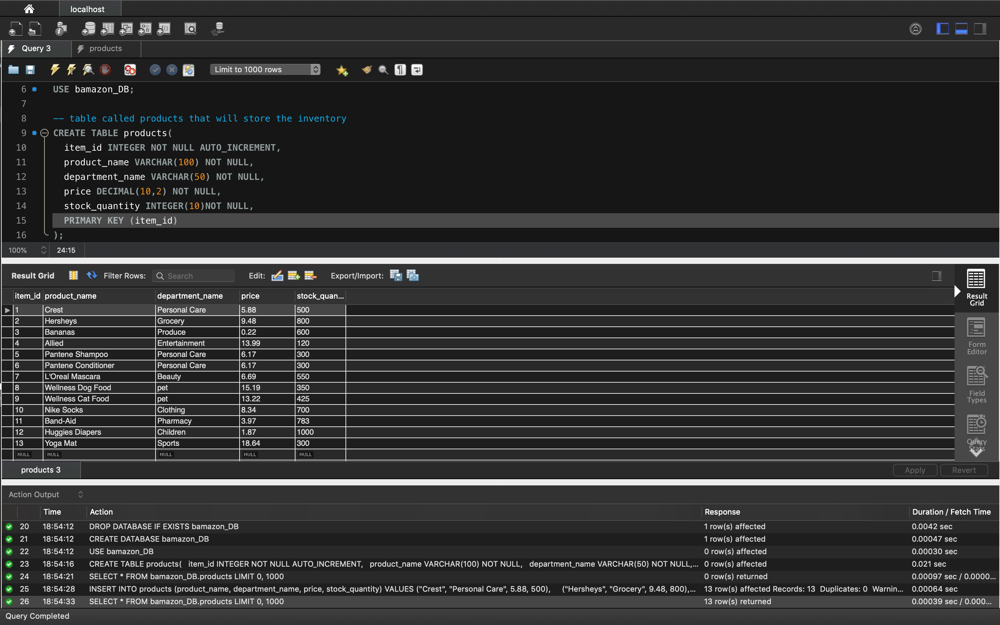
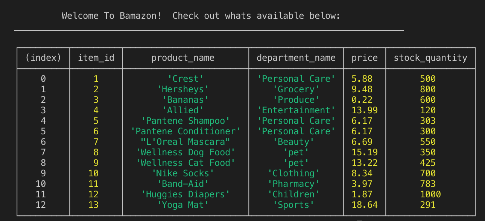

# Bamazon

Welcome to Bamazon, an Amazon-like store front.  The application presents two interfaces: customer and manager.  Customers will be able to see a table containing all items available along with the department, and price of the item.  If customer types an invalid ID, they will get notified.  They will recieve a final reciept of their purchase.  

Managers will be able to check inventory, add inventory, and change prices.  The quantity of stock will adjust when customers purchase, and they will be able to see a selected amount of stock that has less than 5 items.

Programs used for this application includ Node.js and MySQL. 

[CLICK TO SEE BAMAZON](https://drive.google.com/file/d/1fWKamO3ddC3I4dVf4qVpvpiQavcc7HZU/view?usp=sharing)

